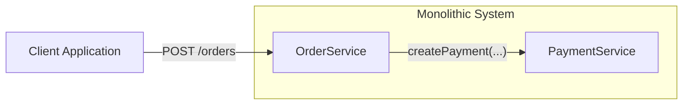
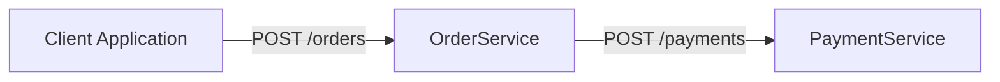

# Contract test

The goal of this project is to show how to test communication between microservices using Contract test.

## Problem definition

What kind of problem migration from monolithic system into microservice based introduced?
 

 

External communication is new challenge - simple method invocation "createPayment(...)" now changed to "POST /payments"
REST endpoint. Moreover, two teams can manage new microservices and have to cooperate to keep system working!
Teams have to establish rules on which they will cooperate.

 

  

 

## Producer driven contracts

## Consumer driven contracts

## Plan

- OpenAPI specification project
- Java and Kotlin example of Consumer driven contracts with Pact 
  - java-consumer-driven
  - kotlin-consumer-driven
  - exchange between each other
  - pact UI 
  - kafka messages 
  - rest 

