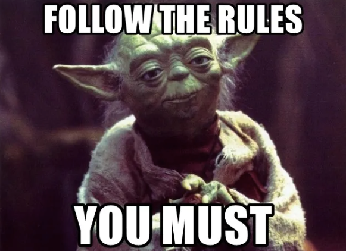
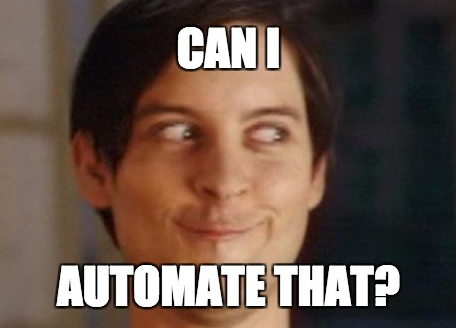
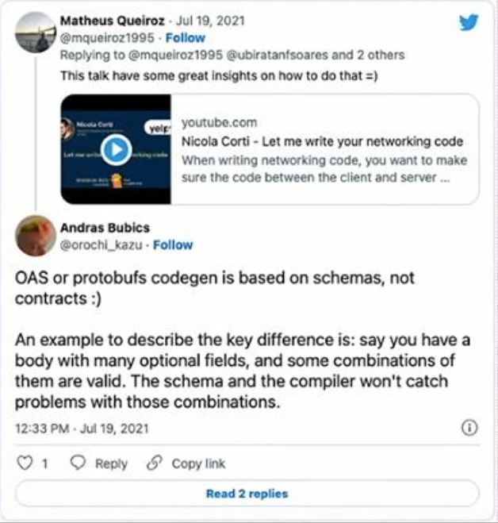
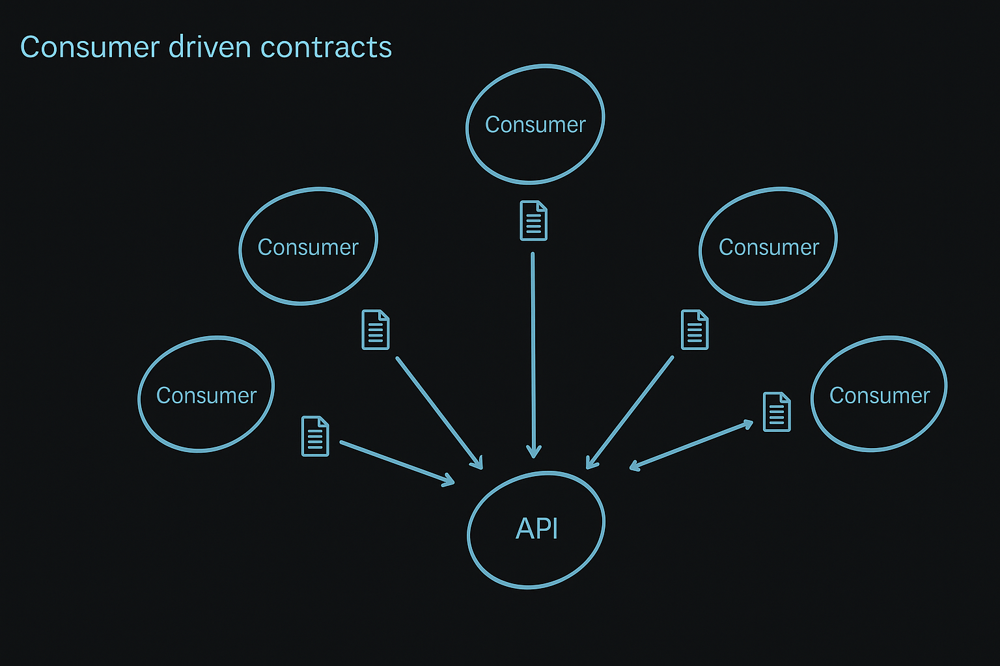
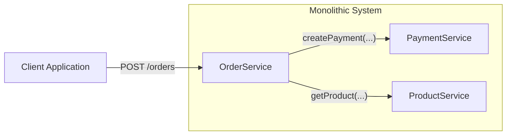
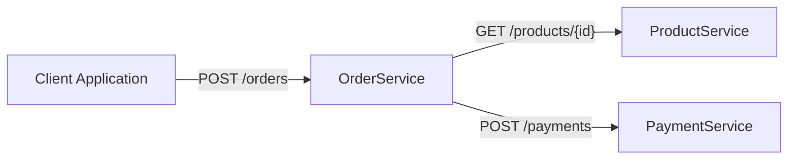
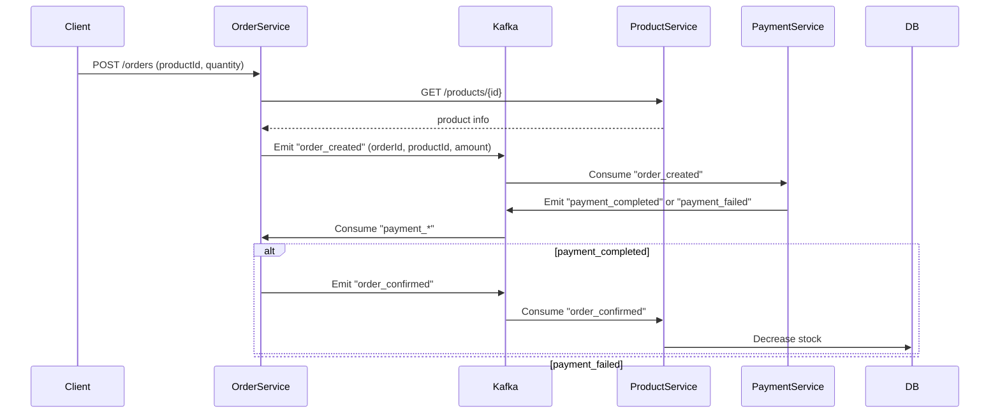

# Contract test

The goal of this project is to show how to test communication between microservices using Contract test.

## Problem definition

What kind of problem migration from monolithic system into microservice based introduced?

- Simple method invocation "createPayment(...)" that could be easily tested now changed to "POST /payments"
- Couple teams can manage new microservices and have to cooperate to keep system working! Teams have to establish rules
  on which they will cooperate.


<br>
<div style="text-align: center;">
  
</div>
<br>

We can publish OpenAPI specification that will show API schema to others teams. We solve the problem for REST APIs and
for sure find other tool for downstream consumers for kafka. 

#### Show some OpenAPI spec

Other teams that want to consume our API have all necessary information and based on that they can create some stubs for
our API and everything is working - right? We have to keep open communication channel in case of any changes, and we are 
perfectly safe. 

<br>
<div style="text-align: center;">
  
</div>
<br>

#### What are contract test and how they automate API changes requests and how they composite in test pyramid 

But wouldn't it be simpler to just use some solutions like gRPC. It comes with nice features like code generation for
all popular platforms, and we don't need to write any test - right?

```
If we just used <insert some new tech> then we wouldn't need contract testing
```

#### What's the point of contract testing when we have auto generated code?

<br>
<div style="text-align: center;">
  
</div>
<br>

#### Describe in detail what is Consumer driven test and what is ideology behind it at the end explain what is Pact 

<br>
<div style="text-align: center;">
  
</div>
<br>

#### Show example diagram what the code will present








## Plan

- OpenAPI specification project
- Java and Kotlin example of Consumer driven contracts with Pact 
  - java-consumer-driven
  - kotlin-consumer-driven
  - exchange between each other
  - pact UI 
  - kafka messages 
  - rest 
  
1. Create full README presentation flow and plan
2. Full example diagram with details Product, Order, Payment
3. Create three modules java-products, kotlin-orders, go-payments
4. Add OpenAPI specification for each one of them

