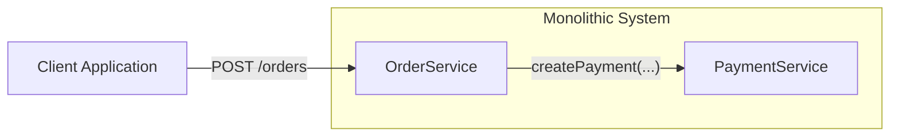

# Contract test

The goal of this project is to show how test communication between microservices with Contract test.

## What are contract test?

What kind of problem migration from monolith system into microservice based introduced?

External communication is new challenge - simple method invocation "createPayment(...)" now changed to "POST /payments"
REST endpoint. Moreover, two teams can manage new microservices and have to cooperate to keep communication up to date.
Teams have to establish rules based on which they will cooperate.

## Producer driven contracts

## Consumer driven contracts

## Plan

- Java and Kotlin example of Producer driven contracts
  - java-producer-driven
  - kotlin-producer-driven
  - exchange between each other
- Java and Kotlin example of Consumer driven contracts
  - java-consumer-driven
  - kotlin-consumer-driven
  - exchange between each other
  - pact UI 
- Kotlin real world example containing 
  - product service
  - users service
  - order service

