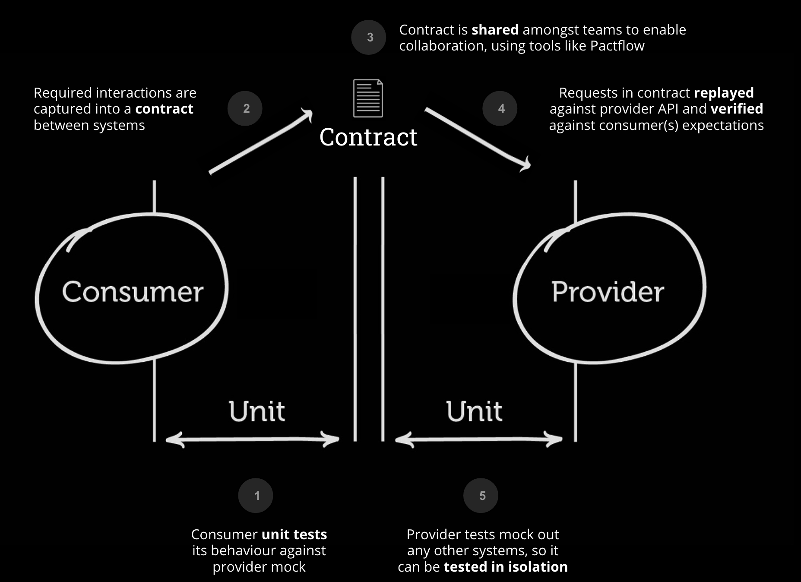
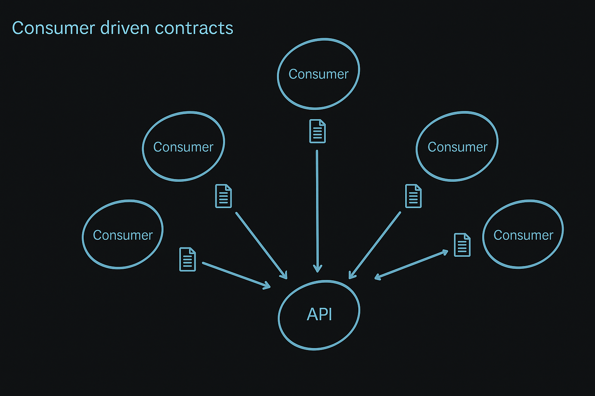
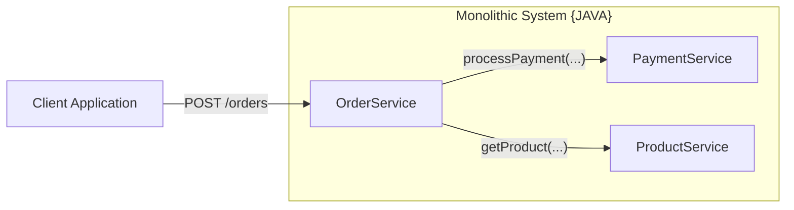
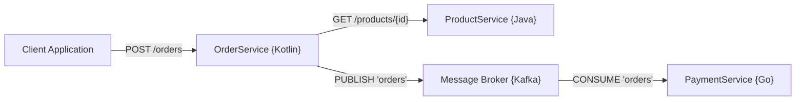
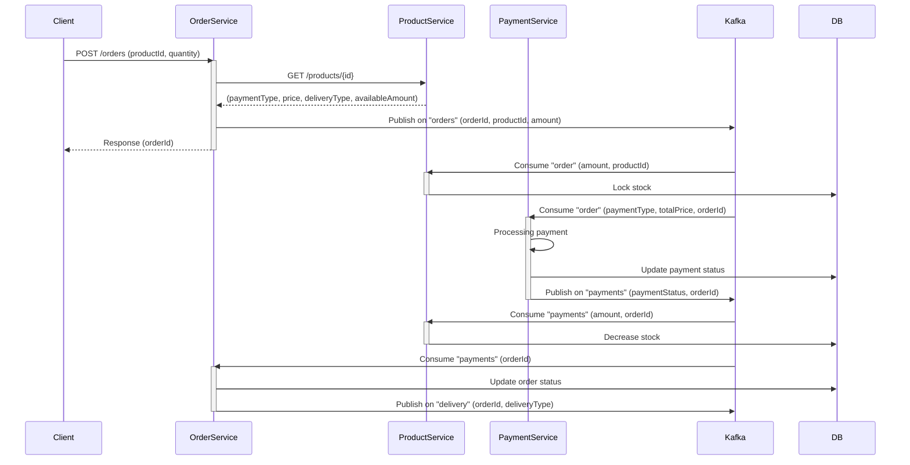

# Contract test

The goal of this project is to show how to test and document communication between microservices using Contract test.

## Problem definition

What kind of problem migration from monolithic architecture to a microservices-based system introduced?
- Transition from in-process to distributed communication, simple function calls "createPayment(...)" change to "POST /payments"
- Codebase fragmentation across microservices, logic is split across multiple independent parties
- Team autonomy and specialization, team's can own a specific service without deep knowledge of other parts of the system
- Greater need for clear contracts, interfaces and APIs, changes to shared interfaces required coordination between teams

<br>
<div style="text-align: center;">
  
</div>
<br>

### OpenAPI specification

We can publish an OpenAPI specification to share the API schema with other teams. For Kafka-based communication, we’ll
need to explore and adopt a similar tooling solution to support downstream consumers.

```
#### Show some OpenAPI spec
```


While publishing an OpenAPI specification is helpful e.g. it allows us to generate stubs and test communication
in isolation. It’s not enough on its own. We still need to coordinate changes with downstream teams through a shared
communication channel and stay disciplined about maintaining and updating the contracts.

<br>
<div style="text-align: center;">
  
</div>
<br>

There is also something else that OpenAPI don't cover, but we will cover it later :)

### Contract test
#### What are contract test and how they automate API changes requests and how they composite in test pyramid 

```
Contract testing is a methodology for ensuring that two separate systems (such as two microservices) are compatible 
and can communicate with one other. It captures the interactions that are exchanged between each service, storing 
them in a contract, which then can be used to verify that both parties adhere to it.
```
<div style="text-align: center;">
  
</div>
<br>
<br>
<br>
<div style="text-align: center;">
  
</div>

```
  #### Show example of contract - suggesting that main point of contract is schema validation
```

But wouldn't it be simpler to just use some solutions like gRPC. It comes with nice features like code generation for
all popular platforms, and we don't need to write any test - right?

```
If we just used <insert some new tech> then we wouldn't need contract testing
```

### What's the point of contract testing when we have auto generated code?

<br>
<div style="text-align: center;">
  
</div>
<br>

#### Describe in detail what is Consumer driven test and what is ideology behind it at the end explain what is Pact 

<br>
<div style="text-align: center;">
  
</div>
<br>

#### Show example diagram what the code will present








### Sources

- [What is contract testing](https://pactflow.io/blog/what-is-contract-testing/)

## Plan
  
1. Create full README presentation flow and plan
2. Full example diagram with details Product, Order, Payment
3. Create three modules java-products, kotlin-orders, go-payments
4. Add OpenAPI specification for each one of them

